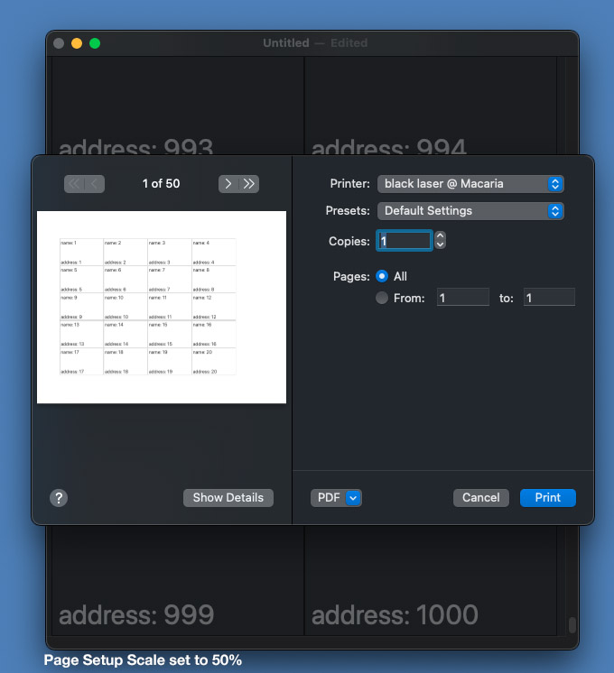

# MultiplePagePrintingSwift
Multiple Page Printing, macOS Swift - by David Phillip Oster

Here's a screenshot of the finished app, showing a scrollview of simulated mailing labels, and on top of it, the Print Dialog with its display of a small preview of the first page.

## What this is

Ignore the scrollview for a moment and think of the content view as one giant rectangle. If you knew the page number,
can you generate a sub-rectangle that's just the content of that page? If you knew the content rectangle of a printable page, could you return the count of pages that would be needed to show all of your content view? NSView has an overridable method for each question, and this repository is a runnable example of an app that prints a thousand business cards or mailing labels, multiple labels per page, and never breaking a label across a page. This repository also handles the **Scale:** text box on the Page Setup dialog, shrinking or zooming the labels in the print.

All of the source code is in Swift. See [MultiplePagePrintingObjC](https://github.com/DavidPhillipOster/MultiplePagePrintingObjC) for the same example, worked in Objective-C.

I could have used an NSCollectionView or an NSGridView for my main content view, but I've chosen to use a view-based NSTableView because it was simple and easy to set up.

The meat of this example, the implementation of the two methods needed to multi-page print are in **PrintTableView.swift** `func knowsPageRange(_ range: NSRangePointer) -> Bool` and `func rectForPage(_ page: Int) -> NSRect` but they work only after their `var`s have been set up in the preparation code in **PrintBoss.swift** - an object that produces and owns the printable view. **Document.swift** owns the `printBoss`, creating it at the start of the print, and destroying it when the print is done.

The `printBoss` looks at the `NSPrintInfo`, getting the dimensions of the printable contentRect from the paper. It also uses the `printInfo.scalingFactor` to adjust the ratio between the PrintTableView's `frame` and `bounds` - this implements the Page Setup's **Scale:** text box.

Since the interactive `NSTableView` in an `NSScrollView` and the `PrintTableView` are showing the same data, it was convenient to use a single object that wraps the model and implements the `NSTableViewDataSource` protocol: **DataSource.swift**

`dataSource` tells the tableView how many labels there are, and when asked for a label, it hands the tableView a filled out view from **LabelView.swift**.

The Document owns a `dataSource`, and passes it the model in `func windowControllerDidLoadNib(_ windowController: NSWindowController)` (in Cocoa a document initializes and reads from the document-file before the U.I exists.)

For file i/o, I've chosen to give the model two methods: `var dictionary: [String:Any]` and `init(dictionary: [String:Any])` so I can ask a **Model** to give me a dictionary representation of itself and given such a representation, construct a new model. I choose the specific dictionary so it can be written to disk with `JSONSerialization.data(…)` and read from it by `JSONSerialization/jsonObject(…)` This gives me a document file format that I can inspect, and repair, in any text editor.

The Document, because it inherits from `NSDocument`, is already listening for window resize notifications, so when the user resizes the window it adjusts the number of columns in the tableView to use the available space.

The Cocoa print system does support a limited auto-pagination function, but all it seems to do is move a single line of text so that the characters aren't sliced through the middle, with the tops at the end of one page and the bottoms at the start of the next. That won't keep our labelViews from getting sliced.

## To Build:

* Open the Xcode project and in the Info panel of the PagePrintExample target change the `com.example` prefix of the bundle Identifier from `com.turbozen.PagePrintSwift`  to a domain you control.

* In the **Signing & Capabilities** panel, choose a team to build and sign with.

* **Build** from the **Product** menu

## Summary

 `func knowsPageRange(_ range: NSRangePointer) -> Bool`  - return number of printed pages in your content view
 
  `func rectForPage(_ page: Int) -> NSRect`  - for a given page by number, from 0 to N, return rectangle of the printable items on that page.

## Previous Work 

as of this writing: 

[MultiplePagePrintingObjC](https://github.com/DavidPhillipOster/MultiplePagePrintingObjC)  is my same example, but worked in Objective-C.

[Paginating an NSTableView](https://lists.apple.com/archives/cocoa-dev/2002/Nov/msg01710.html) handles cell based tableViews, but doesn't work for view-based ones.

[How to Print on macOS With An NSTableView and Customize the Result](https://christiantietze.de/posts/2021/06/printing-nstableview-with-label/) uses an NSStackView and seems to work, but it's just Cocoa's auto-pagination, it only apparently works because the cells are just a single one-line of text. Extending it to mailing labels makes it fail.

## License

Apache License Version 2

